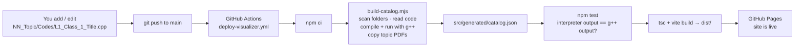
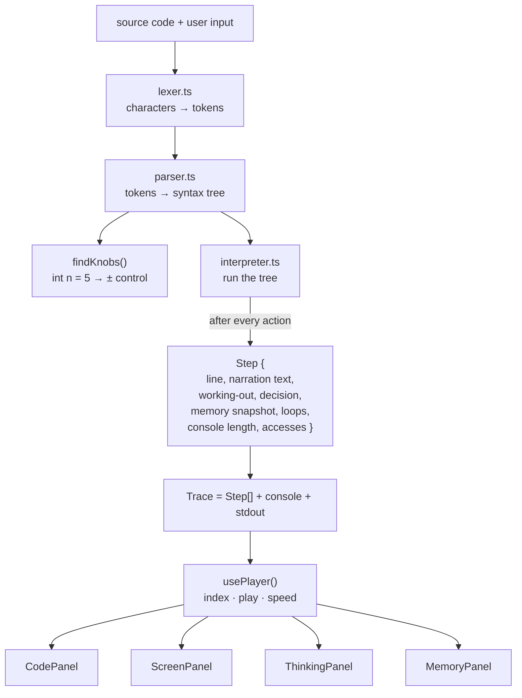
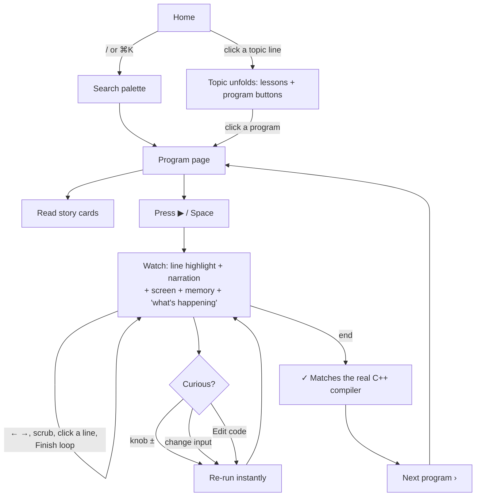

# DryRun — Flow

This document explains how things move through the system:
1. **Course → website:** how a `.cpp` file you add becomes a page.
2. **Code → animation:** how a program becomes animated steps.
3. **User journey:** what a visitor clicks through.

---

## 1. Course → website (the update pipeline)



**What gets picked up automatically**
| You add… | The site shows… |
|---|---|
| A new topic folder `07_Arrays/Codes/…` | A new "line" on the home page (`07 Arrays`), marked **Latest** |
| A new file `L2_HW_3_Something.cpp` | A new button under *Lesson 2* with an `HW3` badge |
| `07_Arrays/Arrays_Content.pdf` | A "Notes (PDF)" link on that topic |
| An entry in `content/programs.json` | A nicer title, plus the *What it does / Think of it like / Watch for* cards and the default input |
| An entry in `content/topics.json` | A tagline and blurb for the topic |

**File-name rule:** `L<lesson>_<Class|HW>_<number>_<Title_with_underscores>.cpp`. Files that don't match still appear, under "More".

**If a future program uses a C++ feature the engine doesn't know yet**, the test step flags it in GitHub Actions but the site **still deploys**. That program's page shows its code, the reason, and the real compiler output, so nothing breaks.

---

## 2. Code → animation (inside the browser)



**Key idea:** the program is run **once, completely**, and every step is recorded. The player then just moves an index through `steps[]`. That is why stepping *backwards* and scrubbing are instant, and why the animation can never get out of sync with the code.

### Engine modules
| File | Responsibility |
|---|---|
| `engine/lexer.ts` | Turns text into tokens (numbers, strings, `'c'` chars, operators). Ignores `#include` and comments. |
| `engine/parser.ts` | Recursive-descent parser for the course subset: variables, all operators, `if/else`, `switch`, `for/while/do`, range-`for`, functions (incl. recursion & references), arrays (1-D/2-D), `vector`, `string`, casts. |
| `engine/values.ts` | C++ value rules: `int` overflow wrap, integer division, `char` ↔ ASCII, and **exact `cout` number formatting** (`%g`, `fixed`, `setprecision`). |
| `engine/interpreter.ts` | Runs the tree and writes the plain-English narration for each step, records the expression working-out, and handles `cin` from the input box. Stops safely on endless loops (20 000 steps) and on runtime errors (divide by zero, index out of range). |
| `engine/trace.ts` | Types for `Step` / `Trace`, the contract between the engine and the UI. |
| `engine/index.ts` | `analyze(source, input)` and the knob helpers: the only API the UI uses. |

### One step, in detail
For `int result = a + b * c - a / b;` the engine emits:
```text
line 8 · kind "decl"
text  : Make a box `result` (int — whole number) and put `a + b * c - a / b` → **11** in it.
evals : b * c → 3 * 2 = 6
        a + b * c → 7 + 6 = 13
        a / b → 7 / 3 = 2   (whole-number division: … the part after the point is dropped)
        a + b * c - a / b → 13 - 2 = 11
frames: main { a=7, b=3, c=2, result=11 }   changed: [result]
```

---

## 3. User journey



### States the program page can be in
| State | When | What the visitor sees |
|---|---|---|
| **Ready** | Normal | Step 1 of N, "Press Space or ▶ to play" |
| **Playing / paused** | ▶ / Space | Steps advance automatically at the chosen speed |
| **Finished** | Last step | "✓ Done" and the compiler-verified badge |
| **Edited** | Knob, input or code changed | A Reset button appears; the verified badge is hidden because the run no longer matches the original |
| **Runtime error** | e.g. divide by zero | The run stops at that line with a red step explaining why |
| **Too long** | Over 20 000 steps (endless loop) | A notice saying it stopped, plus everything up to that point |
| **Can't animate** | Syntax error or unsupported feature | The error line is highlighted, with a message and the real compiler output |

---

## 4. Data contract: `catalog.json`
```jsonc
{
  "compiler": "g++ (Ubuntu …)",
  "topics": [{
    "id": "06_Patterns", "order": 6, "title": "Patterns",
    "tagline": "…", "blurb": "…", "notes": "notes/06_Patterns.pdf",
    "programs": [{
      "id": "06_Patterns/L3_Class_1_Star_pyramid",
      "lesson": 3, "kind": "Classwork", "index": 1,
      "title": "Star pyramid", "summary": "…", "analogy": "…", "watchFor": "…",
      "usesInput": false, "input": null,
      "source": "#include <iostream> …",
      "expectedOutput": "    *\n   ***\n …"
    }]
  }]
}
```
This file is generated. Never edit it by hand: edit the `.cpp` files or `content/*.json` instead.
